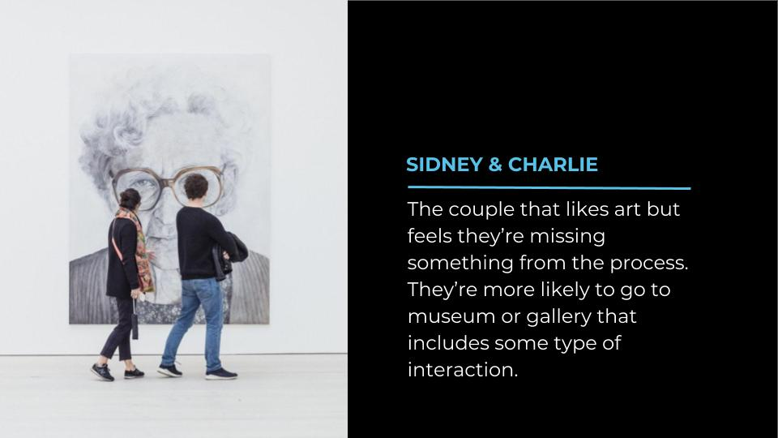

## The User

## The Challenge
How might I create an interactive game that teaches players to notice and understand more about fine art. How can I make fine art fun? How can I pay homage to The Cleveland Museum of Art, which inspired me to become a front end developer?

## User Focused Goals:
- Gamify fine art by creating a multiplayer game that encourages the player to take a closer look at the intricacies of that art.
- Include a drawing component building on a current exhibit at The Cleveland Museum of Art that users wished required more skill.
- Pay homage to The Cleveland Museum of Art’s interactive gallery, ARTLENS Gallery built by Local Projects which inspired me to become a developer.
- Use technology to help build understanding and knowledge that can be carried to traditional art experiences.

## The Cleveland Museum of Art

ARTLENS Gallery at The Cleveland Museum of Art in an interactive gallery experience created by Local Projects. Upon its debut, ARTLENS offered the largest multitouch MicroTile screen in the United States. At 40-feet-wide the wall displays over 4,000 images from the museum’s collection and allows users to browse works, build tours, and interact with art that is both in rotation and in storage. Along with the ever impressive ARTLENS wall, the gallery also displays an array of other experiences for guests to interact with both digital and physical art.

This gallery is the impetus behind my path to development. It helped me to realize how interactive media experiences can stimulate learning and growth in an engaging and fun way. For my final capstone at Nashville Software School, I wanted to delve into my own version of an ARTLENS interactive art experience using it to showcase my skills in User Interface Design and rapid React development. 

## The Code:
In this project there are three pieces of code that stand out: 1. Creating my first project with multiple interacting views. 2. The Canvas view that experiences no direct interaction and changes completely based on changes to the database and state. And 3. Creating a multiplayer game that returns different views to each player’s own device without authentication.

I’m particularly proud of the third; using Firebase and local storage, I was able to create a game where the user can use their phone or tablet to scan a QR code and fully play a game without downloading an app or authenticating. This was a big deal to my user who is most interested in experiencing an exhibit without having it follow them around for the rest of their days. To the left is the code that makes this possible, a series of database fetches and listeners, x lines of code that make a difference.

## Technology
- react
- firebase
- rebase
- local storage
- react canvas draw
- react color
- react router dom
- bootstrap
- reactstrap